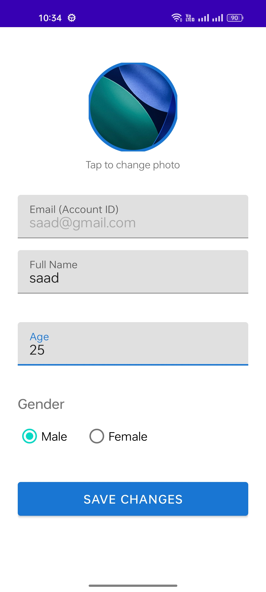

# 💪 Workout Tracker

An Android app to log workouts, track progress, and manage your personal fitness data — built with Kotlin and Material Design.

## Features

- **Multi-User Auth** — Sign up and sign in with separate accounts, each user sees only their own data
- **Workout Logging** — Add, edit, and delete exercises with name, sets, reps, weight, and category
- **Progress Summary** — View total workouts, sets, reps, and estimated calories burned
- **Profile Management** — Set your name, age, gender, and profile picture from gallery
- **Navigation Drawer** — Quick access to all screens with live profile header sync
- **In-Memory Storage** — No database; all data lives in RAM and resets on app restart

## Tech Stack

| | |
|---|---|
| Language | Kotlin |
| UI | XML, ViewBinding, Material Design |
| Components | RecyclerView, DrawerLayout, NavigationView, CardView |
| Architecture | Singleton Repository (RAM-based) |
| IDE | Android Studio |

## Calories Formula

```
Estimated Calories = (Sets × Reps × Weight) × 0.1
```

## Getting Started

```bash
git clone https://github.com/MianSaadTahir/WorkoutTracker.git
```

Open in Android Studio → Sync Gradle → Run

> Minimum SDK: API 24 | JDK 17 required

## Screenshots

<div style="display:flex; gap:8px; flex-wrap:wrap">
  
  
  
  
  
  
  
  
</div>

---
*Built as part of a Mobile Application Development (MAD) course project.*
