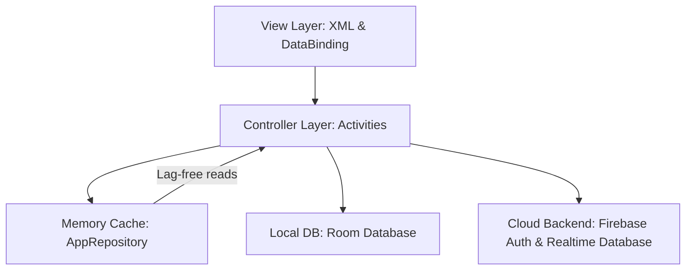
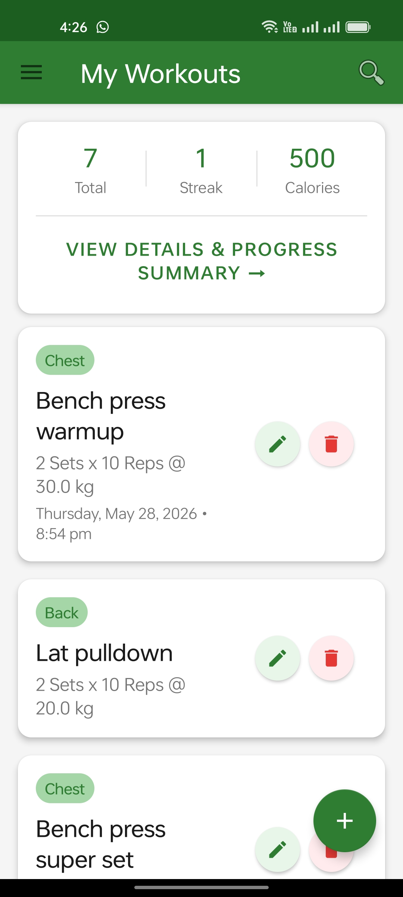
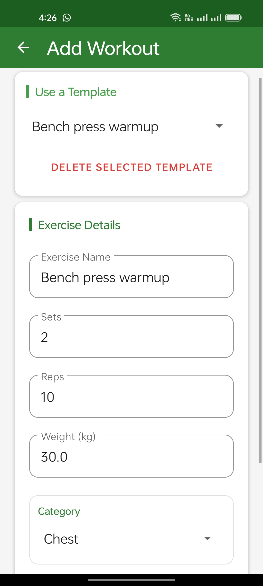
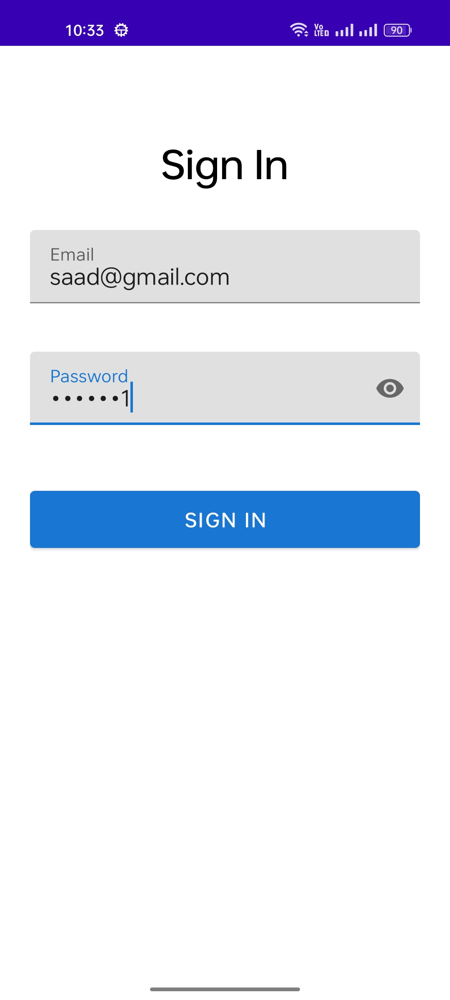
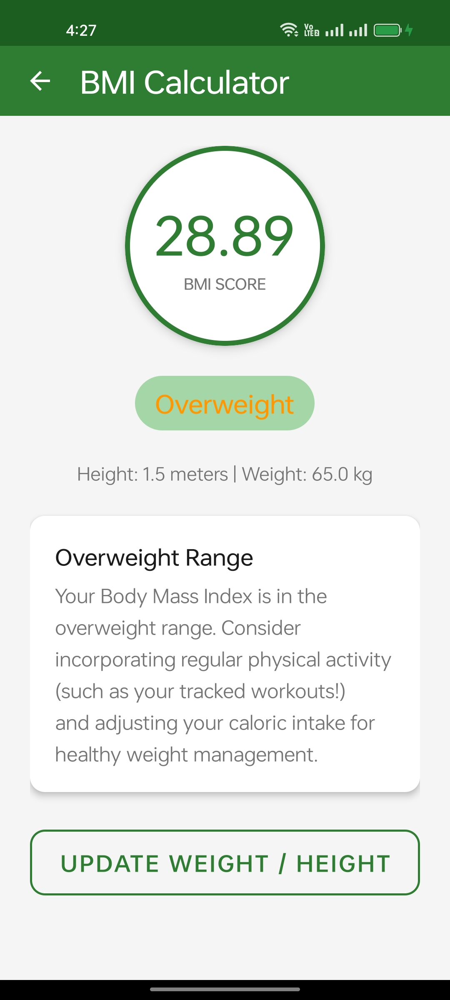
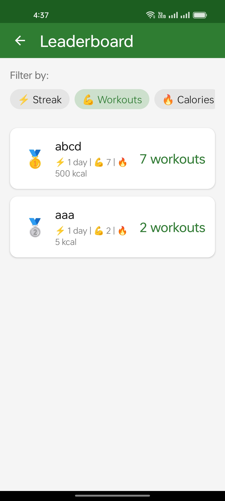
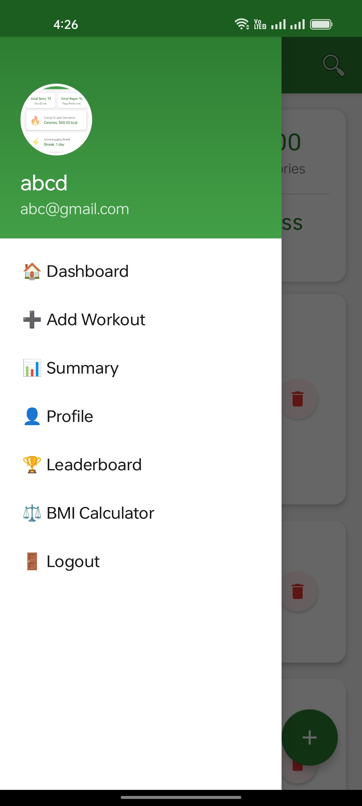
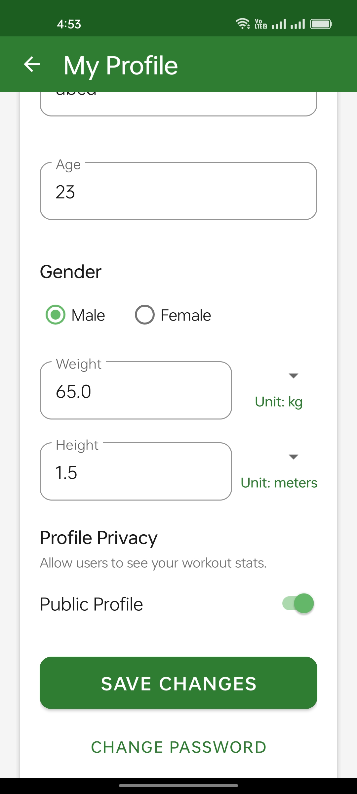

# 🏋️ Workout Tracker

A native Android application designed to help users log workouts, track streaks, calculate BMI, check interactive leaderboards, and securely manage their personal profiles. Built with **Kotlin**, **Android Jetpack**, and **Firebase**, this project employs dynamic animations, modern Material Design, local caching, and robust security workflows.

---

## 📌 Table of Contents
* [Features](#-features)
* [Architecture & Tech Stack](#-architecture--tech-stack)
* [Screenshots](#-screenshots)
* [Setting Up the Project](#-setting-up-the-project)
* [Verification & Testing](#-verification--testing)
* [Documentation](#-documentation)
* [Contributing](#-contributing)
* [License](#-license)
---

## ✨ Features

### 1. 📊 Interactive Dashboard
* **Dynamic Statistics Overview**: Displays daily summaries of burnt calories, total active hours, and completed workouts.
* **Consecutive Day Streak Banner**: Real-time timezone-safe streak calculator displaying the user's active consecutive logging streak.
* **Collapsible SearchView**: Premium search bar integrated into the toolbar that dynamically filters workouts by name and auto-collapses on activity transitions.

### 2. 📝 Workout Management & Templates
* **Add & Edit Workouts**: Log customized workouts with explicit fields for title, duration, and calories.
* **Quick Templates**: Instantly populate form fields using predefined workout configurations.
* **Timestamps Logger**: Auto-stamps every workout with precise logging date and time, maintaining exact creation records during subsequent edits.

### 3. ⚖️ BMI Calculator
* **Double-State Responsive Layout**:
  * **Missing Details Screen**: Gracefully detects if physical metrics are missing ($\le 0$), prompting the user with an attractive state illustration and a direct link to complete their profile.
  * **Score Dashboard**: Dynamically computes BMI scores with high-precision unit conversions ($1 \text{ lb} = 0.453592 \text{ kg}$, $1 \text{ inch} = 0.0254 \text{ meters}$).
* **Color-Coded Status Pills**: Highlights weight classifications clearly: **Underweight** (Amber), **Normal Weight** (Green), **Overweight** (Orange), or **Obese** (Red).
* **Personalized Medical Recommendations**: Renders contextual, tailored medical and nutritional advice based on the calculated range.

### 4. 🏆 Public Leaderboard
* **Multi-Factor Sorting**: Sort top public users on the fly by **Streak Day Score**, **Total Workouts Count**, or **Total Calories Burnt** via interactive Material Chip filters.
* **Real-time Ranking Badges**: Awards distinct top-three icons (🥇, 🥈, 🥉) and `#Rank` badges.
* **Strict Privacy Guards**: Filters out users who have opted for a private profile, ensuring strict data protection.

### 5. 👤 Dynamic User Profile
* **Physical Profile Form**: Update age, gender, weight (with spinner options: `kg`/`lb`), and height (with spinner options: `meters`/`inches`).
* **Visual Selection Indicators**: Dynamic text indicators displayed directly under spinners to clearly show the currently selected options.
* **Profile Photo Room Database**: Select a custom profile picture, compressed and serialized locally into a Room database as a Base64 string for offline retrieval.
* **Profile Privacy Toggle**: Simple switch material to toggle profile privacy (Public vs Private) on-the-spot.
* **Secure Change Password**: Dedicated Change Password screen protected by strict registration-strength validation regex and real-time Firebase Auth reauthentication.

---

## 🛠️ Architecture & Tech Stack

The project adheres to modern Android architecture principles:



* **Frontend**: XML layouts built using Material Design components, custom drawables, and responsive vector icons.
* **Database & Caching Layer**:
  * **Firebase Realtime Database**: Cross-device, live database synchronization.
  * **Room Database**: Local SQLite abstraction used to cache Base64 profile pictures, achieving ultra-fast offline image rendering.
  * **AppRepository Memory Cache**: Standard memory-based caching storing active user objects.
* **Authentication**: **Firebase Auth** handles secure email/password registration, login, and on-demand user reauthentication.

---
## Screenshots

  
  
  
  
  
  
  
---


## 🚀 Setting Up the Project

### 📱 Direct APK Installation
You can install the pre-built application package directly:
* Head to the [assets/](file:///Users/saad/Documents/UET/Sem6/MAD/Project/workout-tracker/assets/) directory.
* Locate and install the [workout-tracker.apk](file:///Users/saad/Documents/UET/Sem6/MAD/Project/workout-tracker/assets/workout-tracker.apk) on your Android device or emulator.

### Prerequisites
* Android Studio (Koala or later recommended)
* Android SDK 34+
* Java Development Kit (JDK) 17+

### Steps
1. **Clone the Repository**:
   ```bash
   git clone https://github.com/MianSaadTahir/workout-tracker
   cd workout-tracker
   ```
2. **Add google-services.json**:
   Obtain your Firebase Configuration File `google-services.json` from the Firebase Console and place it into the `app/` directory.
3. **Build the Project**:
   Compile the source files and verify Gradle configurations:
   ```bash
   ./gradlew compileDebugKotlin
   ```
4. **Assemble Debug APK**:
   Generate the debug binary:
   ```bash
   ./gradlew assembleDebug
   ```

---

## 🧪 Verification & Testing

Verify that compilation and build processes complete successfully with:
```bash
./gradlew build
```


---

## Documentation

For a detailed overview, refer to the [Documentation](./documentation) in the repository.


---


## Contributing

Contributions, issues, and feature requests are welcome!  
Feel free to check out the [issues page](https://github.com/MianSaadTahir/workout-tracker/issues).

---

## 📄 License

This project is licensed under the [MIT License](https://github.com/MianSaadTahir/workout-tracker/blob/main/LICENSE).